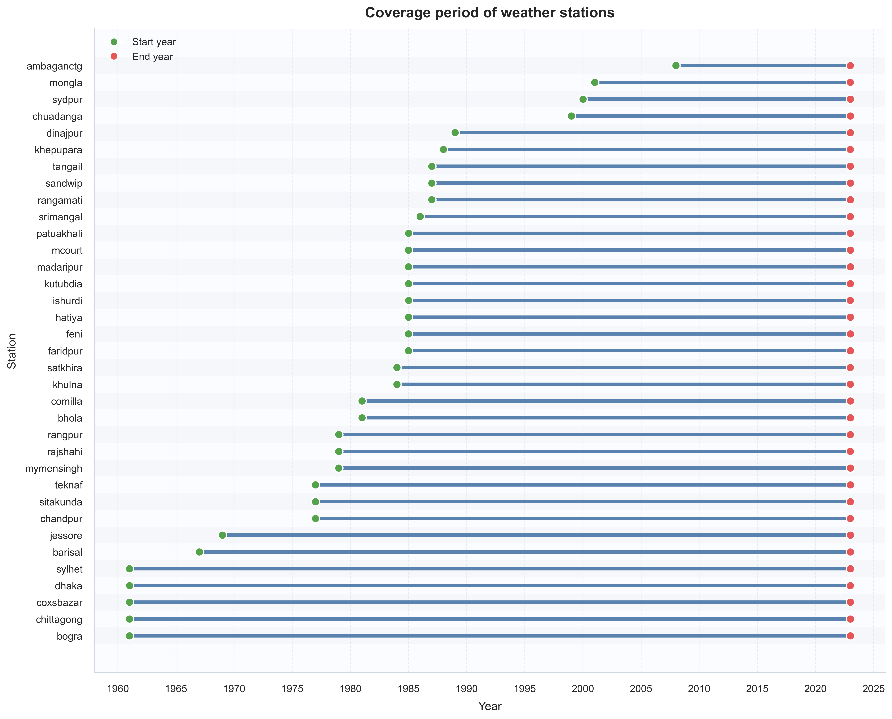
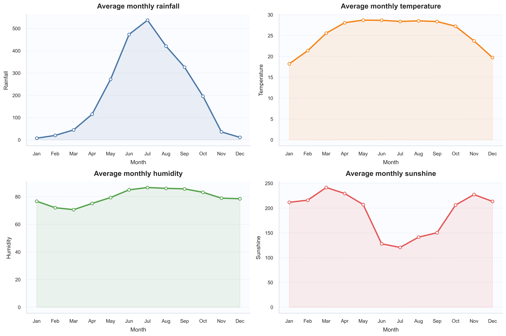
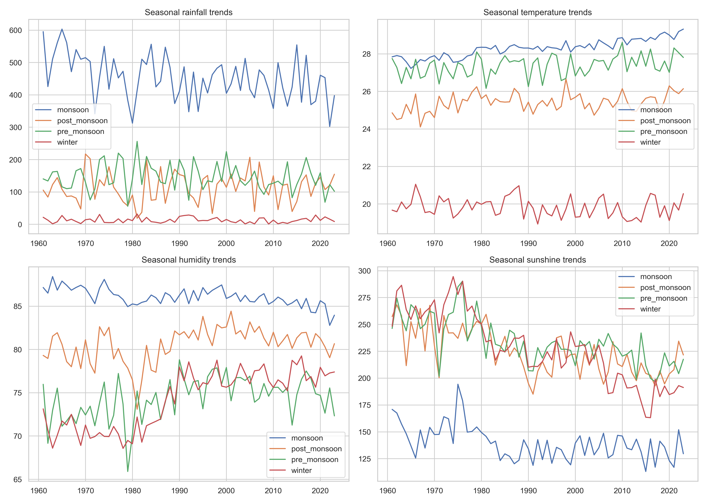
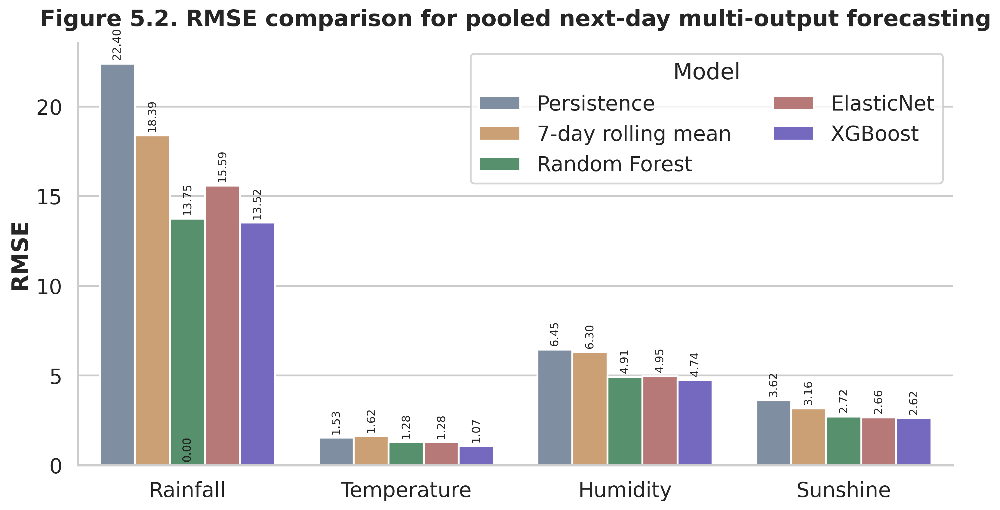
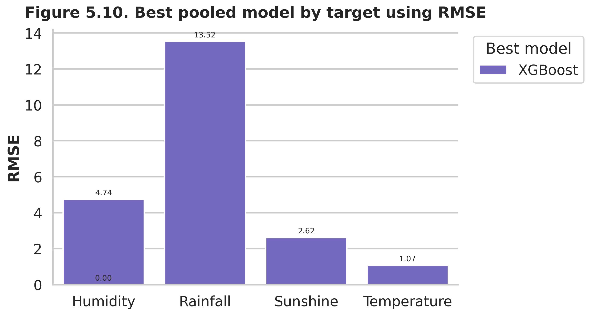
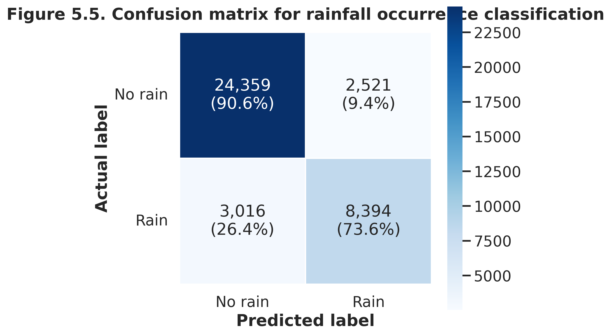
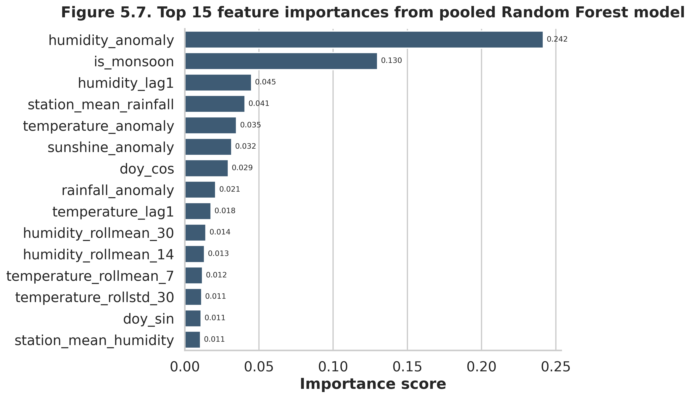

# weather-forecasting-bd
# 📌
# Long-Term Statistical Analysis and Comparative Multi-Output Weather Forecasting for Bangladesh Using Station-Wise Meteorological Data

[](https://www.python.org/)
[](https://scikit-learn.org/)
[](https://xgboost.readthedocs.io/)
[](https://tensorflow.org/)
[](https://www.statsmodels.org/)
[](https://opensource.org/licenses/MIT)

---

## 📌 Executive Summary

This repository contains the complete codebase, statistical analysis, and predictive modeling pipeline for the undergraduate research project titled **"Long-Term Statistical Analysis and Comparative Multi-Output Weather Forecasting for Bangladesh Using Station-Wise Meteorological Data"** at the **Department of Statistics, Pabna University of Science and Technology (PUST)**.

The project investigates 63 years (1961–2023) of daily observational meteorological records across 35 surface stations of the **Bangladesh Meteorological Department (BMD)**. It integrates long-term climate dynamics (climatology, stationarity, trend detection, extreme event evolution) with a comparative multi-horizon forecasting framework spanning baseline heuristics, regularized linear models, tree-based ensemble learning, deep bidirectional sequence networks, and classical seasonal time-series methods.

---

## 🎯 Key Research Objectives

1. **Long-Term Climatological Characterization:** Quantify central tendency, dispersion, extreme skewness, and seasonality of four core variables: **Daily Rainfall, Temperature, Relative Humidity, and Sunshine Duration**.
2. **Spatial & Temporal Trend Analysis:** Detect regional climate gradients and determine the decadal monotonic trends across national and station-level series using Ordinary Least Squares (OLS) and non-parametric tests.
3. **Extreme Event Tracking:** Quantify historical trends in extreme climatic thresholds (Heavy Rain Days, Very Heavy Rain Days, High Humidity Days, and Low Sunshine Days).
4. **Comparative Multi-Output Forecasting:** Benchmark next-day multi-target regression models (Persistence, 7-day Rolling Mean, ElasticNet, Random Forest, XGBoost) across national pooled data.
5. **Decoupled Rainfall Modeling:** Separate zero-inflated rainfall occurrence classification from continuous rainfall amount regression.
6. **Station-Specific Deep Sequence Modeling:** Evaluate whether a Bidirectional LSTM (Bi-LSTM) network captures complex temporal dependencies at a representative station (Dhaka).
7. **Temporal Scale Sensitivity:** Investigate whether model superiority changes when aggregating daily data to monthly seasonal forecasts by comparing **SARIMA vs. XGBoost** for Dhaka.

---

## 📂 Dataset Description & Meteorological Coverage

* **Data Source:** Bangladesh Meteorological Department (BMD)
* **Temporal Scope:** 1961 – 2023 (63 years; 543,839 daily station records)
* **Spatial Footprint:** 35 synchronized surface weather stations across all climatic zones of Bangladesh (Dhaka, Chittagong, Sylhet, Cox's Bazar, Rajshahi, Bogura, Barisal, Khulna, etc.)
* **Primary Meteorological Variables:**
  * **Rainfall (mm/day):** 24-hour accumulated precipitation.
  * **Temperature (°C):** Daily mean ambient surface temperature.
  * **Relative Humidity (%):** Daily mean atmospheric moisture content.
  * **Sunshine Duration (hours/day):** Daily recorded bright sunshine hours.

---

## 🔬 Part I: Long-Term Statistical Analysis & Key Findings

### 1. Overall Descriptive Statistics (1961–2023)
Total Daily Observations: **543,839**

| Variable | Count | Mean | Median | Std. Dev. | Min | Max | Skewness | Distribution Profile |
| :--- | :---: | :---: | :---: | :---: | :---: | :---: | :---: | :--- |
| **Rainfall (mm/day)** | 543,839 | 6.733 | 0.0 | 19.367 | 0.0 | 590.0 | **+5.764** | Zero-inflated, highly positive skew |
| **Temperature (°C)** | 543,839 | 25.571 | 26.9 | 4.167 | 0.0 | 37.8 | **-0.811** | Moderately negative skew, smooth |
| **Relative Humidity (%)** | 543,839 | 79.849 | 81.0 | 8.938 | 10.0 | 100.0 | **-0.853** | High-mean clustered, persistent |
| **Sunshine (hours/day)** | 543,839 | 6.279 | 7.2 | 3.349 | 0.0 | 22.2 | **-0.555** | Bimodal with overcast zero-pileup |

### 2. Seasonal Climatology Matrix
* **Monsoon (Jun–Sep):** Dominates annual wetness with mean rainfall of **14.41 mm/day**, peak humidity (**85.82%**), and lowest sunshine (**4.43 h/day**).
* **Pre-monsoon (Mar–May):** Warmest transition period (Mean Temp: **27.45°C**, peak sunshine: **7.37 h/day**).
* **Winter (Dec–Feb):** Driest and coolest phase (Mean Rainfall: **0.42 mm/day**, Mean Temp: **19.73°C**).

### 3. Spatial Heterogeneity (Station Contrasts)
* **Rainfall:** Sylhet recorded the highest long-term mean (**11.23 mm/day**), while Rajshahi recorded the lowest (**3.88 mm/day**).
* **Temperature:** Mongla recorded the highest mean (**26.35°C**), while Srimangal was the coolest (**24.48°C**).
* **Humidity:** Patuakhali was the most humid (**84.06%**), whereas Dhaka had the lowest mean (**74.62%**).
* **Sunshine:** Cox's Bazar had the longest daily duration (**7.12 h/day**), and Bhola had the lowest (**5.37 h/day**).

### 4. Inter-Variable Correlation Structure (Spearman's $\rho$)
* **Humidity vs. Sunshine:** $\rho = -0.62$ (Strongest inverse atmospheric link).
* **Rainfall vs. Humidity:** $\rho = +0.54$ (Moderate positive co-occurrence).
* **Rainfall vs. Sunshine:** $\rho = -0.42$ (Cloud cover/precipitation suppression).
* **Temperature:** Exhibits weak daily linear dependence with rainfall ($\rho = +0.23$) and humidity ($\rho = +0.15$), confirming that temperature is governed predominantly by seasonal solar forcing rather than immediate daily wetness.

### 5. National Long-Term Decadal Trends (1961–2023)
Linear trend slopes fitted on coverage-aware national aggregates:

| Metric / Variable | Overall Mean | Annual Slope (per year) | Decadal Slope (per decade) | $R^2$ | p-value | Significance |
| :--- | :---: | :---: | :---: | :---: | :---: | :---: |
| **Annual Rainfall** | 2519.11 mm | **-6.968 mm** | **-69.685 mm** | 0.147 | $1.93 \times 10^{-3}$ | Significant Decline |
| **Annual Temperature**| 25.48 °C | **+0.010 °C** | **+0.105 °C** | 0.384 | $6.07 \times 10^{-8}$ | Significant Warming |
| **Annual Humidity** | 79.31 % | **+0.046 %** | **+0.464 %** | 0.337 | $6.24 \times 10^{-7}$ | Significant Increase |
| **Annual Sunshine** | 2394.64 hours| **-10.413 h** | **-104.131 h** | 0.688 | $4.51 \times 10^{-17}$| Significant Decline |

---

## 🤖 Part II: Predictive Modeling & Machine Learning Results

### 1. Data Splitting & Feature Engineering
* **Partition Strategy:** Strict chronological split to eliminate future lookahead data leakage.
  * **Train Set:** Data up to Dec 31, 2017 (**466,104 samples**)
  * **Validation Set:** Jan 01, 2018 – Dec 31, 2020 (**38,360 samples**)
  * **Test Set:** Jan 01, 2021 – Dec 31, 2023 (**38,290 samples**)
* **Feature Engineering:**
  * Multi-step lags ($t-1, t-3, t-7, t-14, t-30$) across all 4 variables.
  * Moving rolling statistics (3, 7, 14, 30-day rolling means and standard deviations).
  * Local station climatological anomalies ($X_{t} - \mu_{\text{station, month}}$).
  * Cyclical Fourier seasonal encodings ($\sin/\cos$ of day of year and month).
  * Binary monsoon indicator and spatial one-hot station identifiers.

---

### 2. Pooled Next-Day Multi-Output Regression Benchmarks (All 35 Stations)

| Target Variable | Model | MAE | RMSE | $R^2$ Score | SMAPE (%) | Rank / Status |
| :--- | :--- | :---: | :---: | :---: | :---: | :--- |
| **Temperature (°C)** | **XGBoost** | **0.823** | **1.074** | **0.935** | **3.25%** | 🏆 **Best Performer** |
| | ElasticNet | 0.991 | 1.280 | 0.907 | 3.98% | Linear Baseline |
| | Random Forest | 1.014 | 1.283 | 0.907 | 4.03% | Ensemble |
| | Persistence (Lag-1)| 1.162 | 1.534 | 0.867 | 4.64% | Baseline |
| | 7-day Rolling Mean | 1.277 | 1.621 | 0.851 | 5.13% | Heuristic |
| **Relative Humidity (%)**| **XGBoost** | **3.592** | **4.741** | **0.697** | **4.64%** | 🏆 **Best Performer** |
| | Random Forest | 3.724 | 4.914 | 0.674 | 4.82% | Ensemble |
| | ElasticNet | 3.769 | 4.952 | 0.669 | 4.87% | Linear Baseline |
| | 7-day Rolling Mean | 4.787 | 6.299 | 0.465 | 6.19% | Heuristic |
| | Persistence (Lag-1)| 4.833 | 6.451 | 0.438 | 6.24% | Baseline |
| **Sunshine (hours)** | **XGBoost** | **2.039** | **2.620** | **0.353** | **50.75%** | 🏆 **Best Performer** |
| | ElasticNet | 2.072 | 2.664 | 0.332 | 50.84% | Linear Baseline |
| | Random Forest | 2.121 | 2.719 | 0.304 | 50.92% | Ensemble |
| | 7-day Rolling Mean | 2.460 | 3.156 | 0.062 | 56.76% | Heuristic |
| | Persistence (Lag-1)| 2.641 | 3.621 | -0.235 | 64.86% | Failed ($R^2 < 0$) |
| **Rainfall (mm)** | **XGBoost** | **5.245** | **13.524** | **0.429** | **165.06%**| 🏆 **Best Performer** |
| | Random Forest | 5.417 | 13.751 | 0.409 | 165.07% | Ensemble |
| | ElasticNet | 7.764 | 15.588 | 0.241 | 167.24% | Linear Baseline |
| | 7-day Rolling Mean | 7.815 | 18.393 | -0.057 | 95.75% | Failed ($R^2 < 0$) |
| | Persistence (Lag-1)| 8.295 | 22.399 | -0.567 | 67.44% | Failed ($R^2 < 0$) |

---

### 3. Binary Rainfall Occurrence Classification
Recognizing rainfall as a two-stage process, event occurrence ($R_{t+1} > 0$ mm) was modeled separately using a **Balanced Random Forest Classifier**:

* **Accuracy:** **85.5%**
* **Precision:** **76.9%**
* **Recall (Sensitivity):** **73.6%**
* **F1-Score:** **75.2%**
* **ROC-AUC:** **0.925**

#### Confusion Matrix (Test Set: 38,290 Days)
```text
                  Predicted: No Rain       Predicted: Rain
Actual: No Rain     24,359 (90.6%)           2,521  (9.4%)
Actual: Rain         3,016 (26.4%)           8,394 (73.6%)


### Station Network Coverage


### Climatology & Seasonality



### Model Performance Comparison



### Rainfall Occurrence Classification


### Feature Importance

